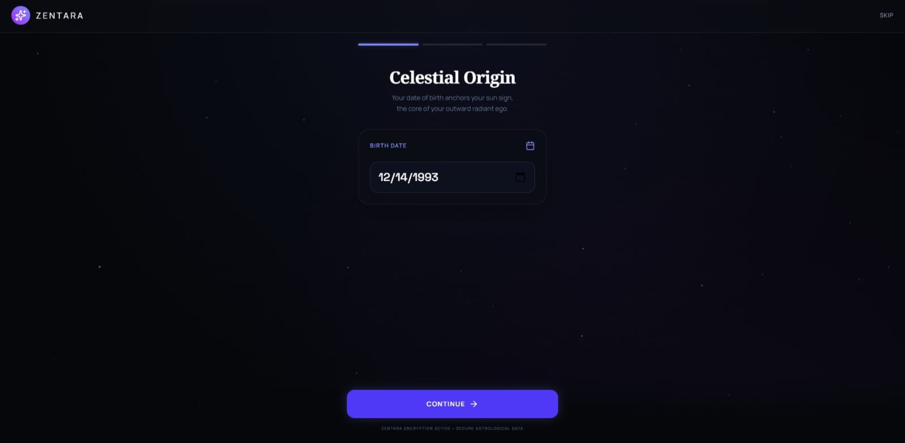
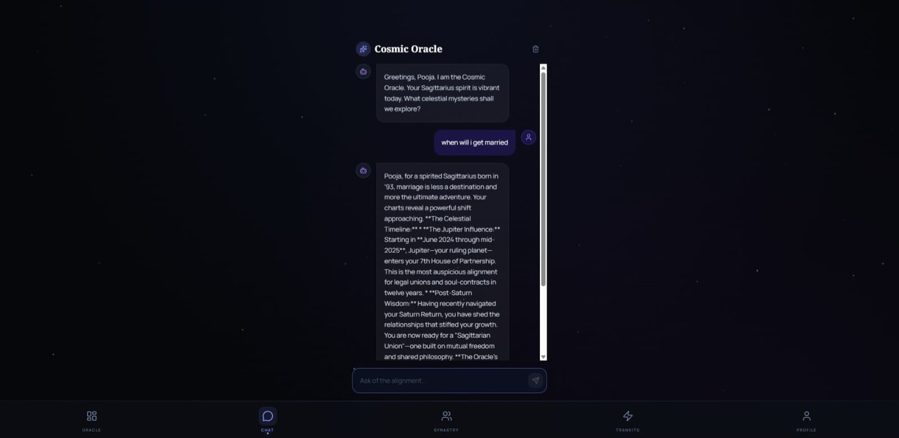
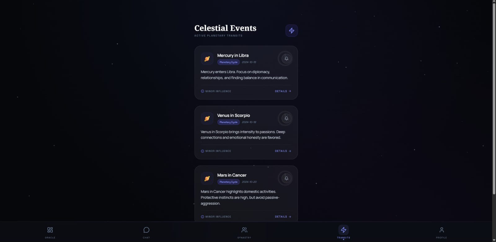
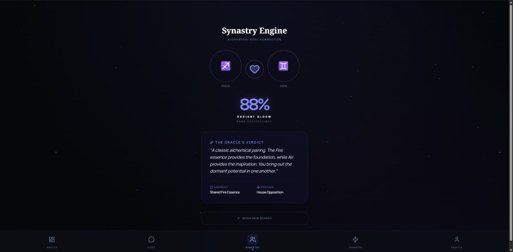
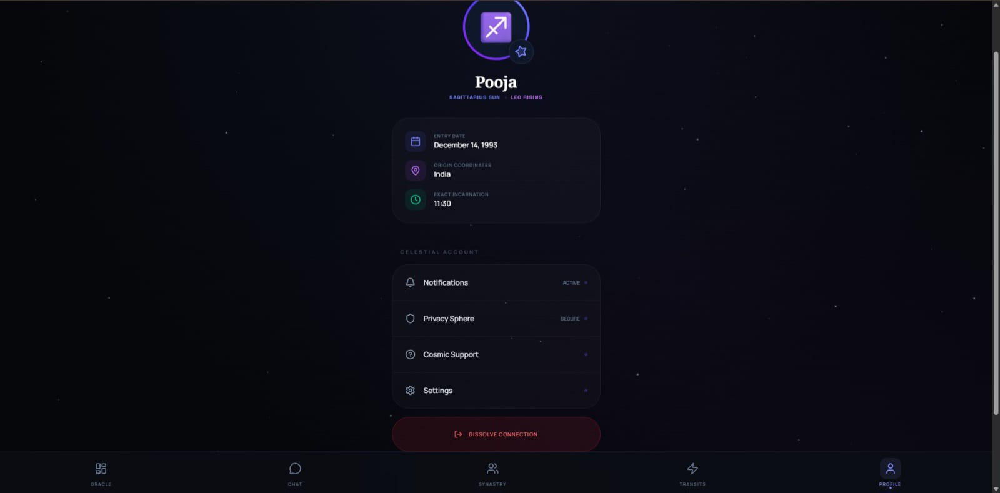

# 🌌 Zentara — AI-Powered Astrology App

Zentara is an AI-driven astrology experience that transforms personal birth data into interactive, real-time insights through a conversational cosmic assistant.

---

## 🚀 Live App  
👉 https://zentara-236597150924.europe-west2.run.app/

---

## 🎥 Demo Video  
🎬 https://youtu.be/xJlplQzKbP8

---

## 📸 Screenshots  

  
  
  
  
  

---

## ✨ Features

- 🔮 Personalized daily horoscope insights  
- 🧠 AI-powered “Cosmic Oracle” chat assistant  
- 💞 Synastry compatibility analysis  
- 🌙 Mood-based adaptive astrology guidance  
- 🌌 Real-time celestial events and transits  
- 👤 User profile with birth chart context  

---

## 🧠 How It Works

Zentara combines:
- User birth data (date, time, location)  
- Astrological logic  
- AI-generated responses via Gemini API  

to create a personalized and interactive astrology experience.

---

## ⚙️ Tech Stack

- Frontend: AI-generated UI (Flutter/Web)  
- AI: Gemini API  
- Deployment: Cloud-based public URL  
- Development: AI-assisted workflow (AI Studio + prompt engineering)  

---

## 📌 Note

This project was built using AI-assisted development tools, focusing on rapid prototyping, design iteration, and functional delivery.

---

✨ From static predictions to interactive guidance — Zentara redefines astrology with AI.
